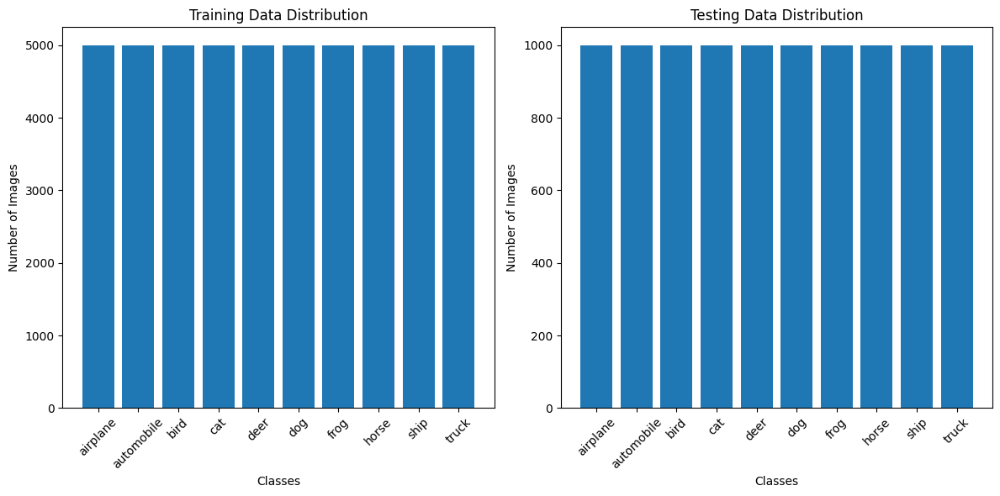

# C++IFAR-10

## CIFAR-10 Augment and Predict
Augmenting the CIFAR-10 dataset with OpenCV in C++, training a CNN model in Python using TensorFlow, and employing Frugally_Deep in C++ for predictions on new data.

## Developers:
- Ilyas el Haroui
    - GitHub Page: [Ilyas El Haroui](https://github.com/Ilyaseh)
- Alan Zhang
    - GitHub Page: [Alan Zhang](https://github.com/alanZhang0813)

## Table of Contents
1. [Introduction](#introduction)
2. [Workflow](#workflow)
3. [Requirements and Installation](#requirements-and-installation)
4. [Data Visualization](#data-visualization)
5. [Sample Augmented Images](#sample-augmented-images)
6. [Project Structure](#project-structure)

## Introduction 
This project demonstrates the integration of C++ and Python in creating and utilizing a Convolutional Neural Network (CNN) for image classification. It involves data augmentation of the CIFAR-10 dataset using OpenCV in C++, building a CNN model in Python using TensorFlow, and employing the Frugally_Deep library in C++ for model predictions.

## Workflow 
1. **Data Augmentation with OpenCV in C++**:
    - Augmenting the CIFAR-10 dataset to enhance model robustness.
    - Image transformations include random cropping, scaling, flipping, Gaussian noise addition, and color jittering.

2. **CNN Model Creation in Python**:
    - Developing and training the CNN model using TensorFlow on the augmented dataset.

3. **Model Inference with Frugally_Deep in C++**:
    - Exporting the trained CNN model from Python to C++ using Frugally_Deep.
    - Performing predictions using the Frugally_Deep library.

## Requirements and Installation 
- C++17 compatible compiler.
- OpenCV library ([OpenCV GitHub](https://github.com/opencv/opencv)).
- Python with TensorFlow installed.
- Frugally_Deep library ([Frugally-Deep GitHub](https://github.com/Dobiasd/frugally-deep)).

## Data Visualization 
### CIFAR-10 Dataset Distribution

## Sample Augmented Images 
### Examples of Augmented Images
Below are examples of augmented images using different techniques:

- **Original Image**:
    - 
- **Random Cropping**:
    - 
- **Scaling**:
    - 
- **Flipping**:
    - 
- **Gaussian Noise**:
    - 
- **Color Jittering**:
    - 

These images showcase the variety of transformations that can be applied to the CIFAR-10 dataset for data augmentation purposes.

## Project Structure 
- **Data Augmentation Module**: Detailed in the [Image Dataset Augmentation README](./augment-images/README.md).
- **CNN Model Creation Module**: Detailed in the [CIFAR-10 CNN Model Creation README](./create-model/README.md).
- **Model Inference Module**: Detailed in the [Frugally-Deep Model Evaluation README](./frugally-deep-imp/README.md).

*Each module's README contains specific details about the implementation, workflow, and requirements.*
